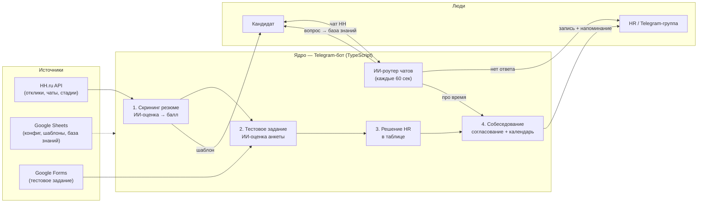

# HH.ru AI Automation

> Telegram-бот, автоматизирующий **полный цикл найма** на HH.ru: от скрининга откликов
> до назначения собеседования — с ИИ-оценкой резюме и тестовых заданий, живой перепиской
> с кандидатами и минимумом ручной работы HR.
>
> *An AI-powered Telegram bot that automates the entire hiring funnel on HH.ru — resume
> screening, test-task grading, candidate Q&A and interview scheduling — keeping the human
> recruiter in control at every decision point.*

---

## 🎯 Проблема

HR тратит часы на рутину: пролистать десятки откликов, отсеять неподходящих, отправить
шаблоны, ответить на одни и те же вопросы кандидатов, согласовать время собеседования,
не забыть про встречу. Всё это — вручную, по каждой вакансии.

## 💡 Решение

Бот берёт рутину на себя, но **финальные решения оставляет за человеком**:

- **оценивает** резюме и ответы на тестовое задание через LLM,
- **пишет** кандидатам по шаблонам и двигает их по стадиям на HH.ru,
- **отвечает** на вопросы кандидатов из базы знаний (а чего не знает — спрашивает у HR
  и запоминает ответ),
- **договаривается** о дате/времени собеседования и записывает встречу в календарь,
- **напоминает** ответственному о встрече за 30 минут.

HR работает в привычных **Google-таблицах** — никакого нового интерфейса учить не нужно.

---

## 🔀 Как это работает



### Воронка по стадиям

| Стадия | Что делает бот |
|---|---|
| **1. Скрининг резюме** | Тянет отклики с HH → LLM ставит балл → `≥7` приглашение в «первичный контакт», `5–6` на ручную проверку HR, `<5` отказ. Шаблон уходит кандидату автоматически. |
| **2. Тестовое задание (анкета)** | Ответы из Google Form матчатся с кандидатом (имя/телефон) → LLM оценивает по критериям → результат в таблицу. |
| **3. Решение HR** | HR ставит в таблице «Подходит / Не подходит». Бот выполняет действие на HH: приглашение или отказ. *ИИ советует — человек решает.* |
| **4. Собеседование** | В чате HH бот согласовывает дату/время → пишет встречу в календарь → переводит кандидата в стадию «Собеседование» → создаёт напоминание за 30 минут. |
| **Q&A (постоянно)** | Единый ИИ-роутер каждые 60 сек читает чаты: вопрос → ответ из базы знаний; не знает → эскалация в Telegram-тему вакансии, ответ HR уходит кандидату **и дописывается в базу** (самообучение). |

---

## 🧱 Архитектура и стек

| Технология | Роль | Почему выбрана |
|---|---|---|
| **TypeScript** | весь код | Строгая типизация критична для интеграционного проекта с множеством внешних API и форматов данных — ловим ошибки до рантайма. |
| **grammY** | Telegram-фреймворк | Современный, лёгкий, с типами и удобной моделью middleware; проще и быстрее «тяжёлых» альтернатив. |
| **PostgreSQL + Prisma** | хранение состояния (пользователи, напоминания о встречах) | Нужна надёжная персистентность; Prisma даёт типобезопасный доступ к БД и миграции. |
| **Google Sheets API** | конфиг вакансий, шаблоны, база знаний, аналитика, календарь | HR уже живёт в таблицах — не нужно строить и поддерживать отдельный UI. |
| **HH.ru API (OAuth2)** | отклики, чаты, стадии кандидатов | Официальная интеграция с работным сайтом. |
| **LLM (OpenAI-совместимый endpoint)** | оценка резюме и анкет, классификация сообщений, генерация ответов | Гибкая семантическая обработка, которую не покрыть правилами. |
| **Express** | OAuth2-callback + служебные endpoint'ы | Минимальный веб-слой для приёма редиректа авторизации. |
| **pm2** | процесс-менеджер | Автозапуск, перезапуски, логи на боевом сервере. |
| **tsx** | запуск TS без сборки | Быстрая итерация — запускаем `.ts` напрямую. |

---

## 📂 Модули: что за что отвечает

```
src/
├─ index.ts                  # Точка входа: команды бота, планировщики, подключение модулей
├─ scheduler.ts              # Планировщик по времени (МСК): часовой анализ, сводки в 7:00/15:00
│
├─ hh-auth/                  # OAuth2 к HH.ru
│  ├─ hh-auth.service.ts     #   авторизация, обновление токена (single-flight + кросс-процессный лок)
│  ├─ token.store.ts         #   хранение токена в файле
│  └─ web-server.ts          #   приём OAuth-callback
│
├─ hhru/                     # Ядро логики найма
│  ├─ hh-api.ts              #   клиент HH.ru API (отклики, чаты, действия, сообщения)
│  ├─ hhru.service.ts        #   оркестрация, список активных вакансий, блокировки от гонок
│  ├─ process-responses.ts   #   скрининг резюме (ветка A) + запуск ручной проверки (ветка B)
│  ├─ manual-check.ts        #   ветка B: действия по решению HR в таблице (идемпотентно)
│  ├─ ai-scorer.ts           #   вызовы LLM + парсинг JSON-ответа
│  ├─ prompt-builder.ts      #   промпты оценки резюме (+ анти-галлюцинация: город/переезд)
│  ├─ sheets-analysis.ts     #   чтение/запись листов анализа, шаблоны автоответов
│  ├─ questionnaire.ts       #   анкета/тестовое: ИИ-оценка + действия по «Действие HR»
│  ├─ interview-chat.ts      #   диалог согласования собеседования (классификация ответов)
│  ├─ interview-chat.store.ts#   состояние диалогов о собеседовании
│  ├─ interview-calendar.ts  #   чтение/запись листа-календаря встреч
│  ├─ chat-router.ts         #   ЕДИНЫЙ поллер чатов: маршрутизация вопрос ↔ собеседование
│  ├─ chat-router.store.ts   #   курсоры прочитанных сообщений + очередь эскалаций
│  ├─ topics.store.ts        #   маппинг «вакансия → тема Telegram-группы»
│  └─ period.store.ts        #   накопление статистики для сводок
│
├─ chat-sim/                 # «Мозг» Q&A по базе знаний
│  ├─ ai-router.ts           #   решение: ответить из базы или эскалировать
│  ├─ vacancies.ts           #   чтение вакансий и листа «Вопрос-ответ»
│  └─ service.ts             #   обработка вопроса + дозапись ответа в базу знаний
│
├─ interviews/               # Синхронизация встреч из календаря → напоминания (Prisma)
├─ notifications/            # Уведомления в Telegram (новые встречи, напоминания за 30 мин)
├─ users/                    # Учёт пользователей (БД)
├─ sheets_responsible/       # Синхронизация ответственных по вакансиям
├─ google/                   # Клиент Google Sheets
└─ lib/prisma.ts             # Клиент Prisma
```

---

## ⚙️ Интересные инженерные решения

- **Ротация OAuth-токена.** HH.ru при каждом refresh ротирует `refresh_token`; два
  одновременных обновления рвут цепочку и отзывают токен. Решено **single-flight внутри
  процесса + кросс-процессным файловым локом** — refresh идёт строго по одному.
- **Идемпотентность и дедуп.** Действия не повторяются: `hasEmployerMessage` игнорирует
  пустые сообщения, ветка B пропускает уже обработанных, у каждого чата свой курсор
  прочитанных сообщений.
- **Человек в контуре (human-in-the-loop).** ИИ только *оценивает*; приглашение/отказ
  на этапе тестового — строго по колонке «Действие HR». Уже обработанных по старой схеме
  не трогаем.
- **Самообучающаяся база знаний.** Вопрос без ответа → эскалация HR → ответ сохраняется
  в лист «Вопрос-ответ», в следующий раз бот отвечает сам.
- **Единый ИИ-роутер.** Один поллер разводит сообщения: короткое «да, вполне» в ответ на
  предложенный слот трактуется как подтверждение встречи, а не как вопрос.
- **Планировщик в часовом поясе МСК**, устойчивый к TZ сервера.

---

## 🚀 Запуск

```bash
# 1. Зависимости
npm install

# 2. Конфиг
cp .env.example .env      # заполнить значения (см. ниже)

# 3. Google-сервисный аккаунт
# положить google-credentials.json рядом (путь — в GOOGLE_CREDENTIALS_PATH)

# 4. База данных
npx prisma migrate deploy
npx prisma generate

# 5. Запуск (dev)
npm run dev
```

Авторизация HH.ru: отправить боту команду **`/auth`** → перейти по ссылке → подтвердить доступ.

## 🔐 Переменные окружения

Полный список — в [`.env.example`](.env.example). Секреты (`.env`, `hh-tokens.json`,
`google-credentials.json`) **в репозиторий не коммитятся** (см. `.gitignore`).

---

## 📌 Статус

Коммерческая автоматизация под конкретный найм. Код приведён как демонстрация
архитектуры и подхода; для запуска нужны свои ключи HH.ru, Google и LLM-endpoint.

> ⚠️ Дисклеймер: репозиторий не содержит реальных токенов, персональных данных кандидатов
> и боевых ключей — только исходный код.
